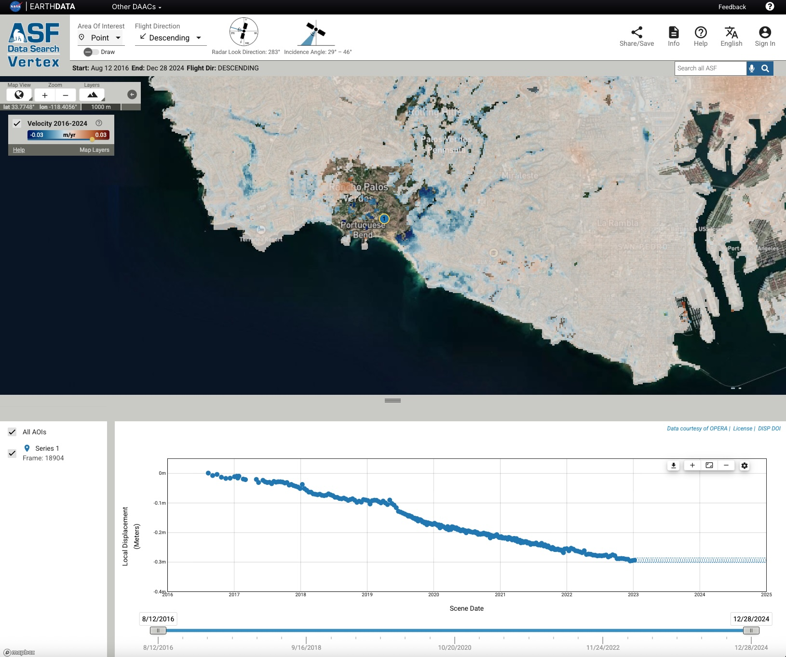

+++
author = "Al Handwerger and Eric Fielding"
title = "Landslides over Palos Verdes"
date = "2025-11-02"
description = "Landslides in Palos Verdes"
+++

The NASA OPERA Displacement products from interferometric synthetic aperture radar (InSAR) time-series of Copernicus Sentinel-1 data (DISP-S1) are available to view in the Displacement portal at the Alaska Satellite Facility (ASF) data archive site. We post an example of the displacements of landslides on the Palos Verdes Peninsula, a hill at the coast south of Downtown Los Angeles and west of the Port of Los Angeles, California. The south side of Palos Verdes has a large ancient landslide deposit that has largely been reactivated since the 1950's, with a new acceleration in 2023 and 2024 after heavy rainfall. Part of the landslide complex is known as the Portuguese Bend Landslide after the name of the area where it is located.

The image below shows a view from the Displacement portal for Palos Verdes. Large parts of the rapidly moving landslide moved too fast for the DISP-S1 product to track after the summer of 2023, so it is masked out on the map. We selected a point on the Portuguese Bend Landslide and the portal shows the displacement over time for that point. The time series plot shows the landslide moved 0.3 meters in the radar line-of-sight direction (down and west) between 2016 and 2023. The time series ends in summer 2023 when the landslide motion accelerated too fast for the Sentinel-1 InSAR to track.

Check this link to the Displacement Portal for the interactive map and [time series](https://displacement.asf.alaska.edu/#/?zoom=13.867&center=-118.368,33.718&dispOverview=VEL&series=POINT(-118.3635473472642%2033.74234173233451)--1--Point--0f438ff3-9275-4c2b-a058-aba43a3096cd--Series&flightDirs=DESCENDING&start=2016-08-12T20:52:08Z&end=2024-12-28T21:52:45Z).
