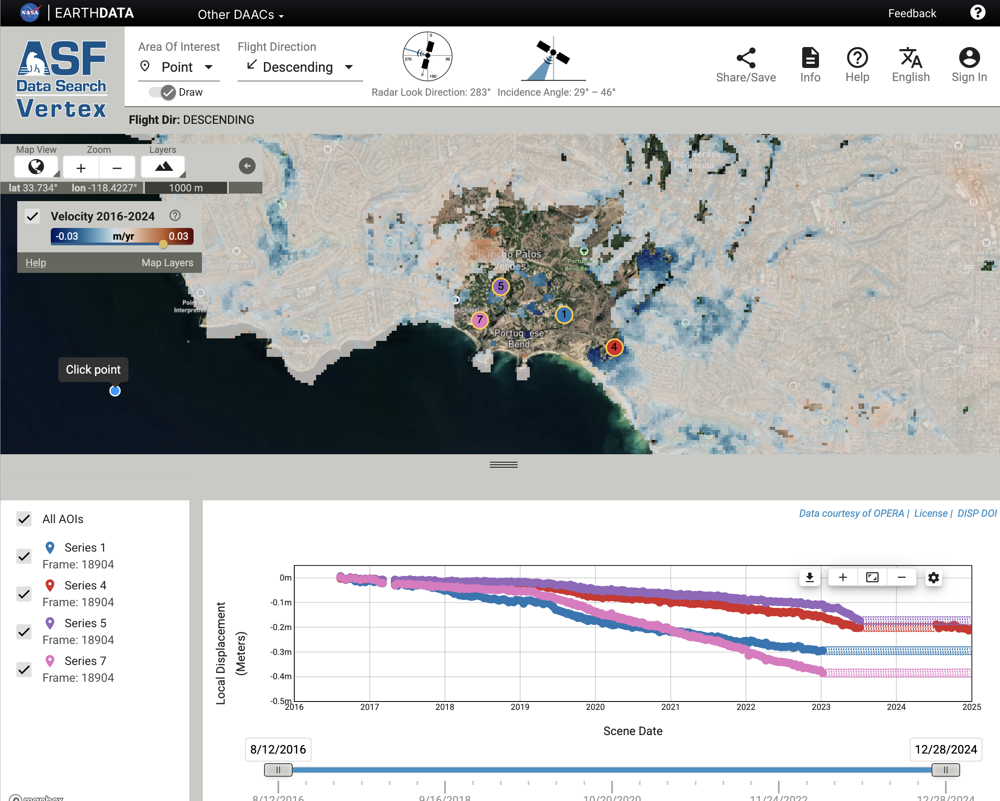

+++
author = "Al Handwerger and Eric Fielding"
title = "Tracking the Palos Verdes Landslides with OPERA DISP-S1"
date = "2025-11-02"
description = "Tracking the Palos Verdes Landslides with OPERA DISP-S1"
+++

The OPERA Surface Displacement from Sentinel-1 (DISP-S1) products measure ground motion in the radar line-of-sight direction, providing insight into both natural and human-driven changes across Earth’s surface.

Here we highlight the application of DISP-S1 products to the Palos Verdes Peninsula landslides in Rancho Palos Verdes, Los Angeles County, California. The area, located southwest of downtown Los Angeles and west of the Port of Los Angeles, includes an ancient landslide complex that has been intermittently reactivated since the 1950s. Following above-average rainfall in 2023 and 2024, parts of this complex—including the well-known Portuguese Bend Landslide—experienced renewed acceleration and reactivation.

This map shows the southwest part of the Los Angeles area, including the Palos Verdes Peninsula and Rancho Palos Verdes (RPV), with the average velocity from the DISP-S1 products on the descending track from 2016–2024. The location of Los Angeles International Airport (LAX) is also marked.

The image below shows a view from the [Alaska Satellite Facility (ASF) Displacement Portal](https://displacement.asf.alaska.edu/#/?zoom=14.577&center=-118.371,33.732&dispOverview=VEL&series=POINT(-118.3635473472642%2033.74234173233451)--1--Point--0f438ff3-9275-4c2b-a058-aba43a3096cd--Series::POINT(-118.35693519702154%2033.738744841976384)--4--Point--92f58248-c2ad-4286-93cd-5535e4acd396--Series::POINT(-118.37189065757795%2033.74539368047165)--5--Point--737219c7-dec6-49ed-9a48-b6ddfce303c0--Series::POINT(-118.37465583352824%2033.74172168283482)--7--Point--dcd5d8ca-8b17-44ed-9efc-5420233b5316--Series&flightDirs=DESCENDING&start=2016-08-12T20:52:08Z&end=2024-12-28T21:52:45Z), which enables quick viewing and analysis of DISP-S1 products. Portions of the landslide are masked where ground motion became too rapid for Sentinel-1 InSAR tracking after summer 2023, or where the data were flagged as low quality (see [FAQ](https://docs.asf.alaska.edu/vertex/displacement/#basic-velocity)). We selected several points within the landslide complex to illustrate how different zones are moving relative to one another. The time series plot shows the landslide moved up to 0.4 meters in the radar line-of-sight direction (down and west) between 2016 and 2024. The time series for several of the points is masked after summer 2023 when the landslide motion accelerated too fast for the Sentinel-1 InSAR to track.

Check this link to the Displacement Portal for the interactive map and [time series](https://displacement.asf.alaska.edu/#/?zoom=13.867&center=-118.368,33.718&dispOverview=VEL&series=POINT(-118.3635473472642%2033.74234173233451)--1--Point--0f438ff3-9275-4c2b-a058-aba43a3096cd--Series&flightDirs=DESCENDING&start=2016-08-12T20:52:08Z&end=2024-12-28T21:52:45Z).

These products are available to download at [ASF Vertex](https://search.asf.alaska.edu/#/?dataset=OPERA-S1&productTypes=DISP-S1&resultsLoaded=true&zoom=8.413&center=-118.067,32.803&granule=OPERA_L3_DISP-S1_IW_F18904_VV_20240701T135248Z_20241228T135245Z_v1.0_20250418T055222Z&polygon=POINT(-118.3657%2033.7423)) or [NASA Earthdata](https://search.asf.alaska.edu/#/?dataset=OPERA-S1&productTypes=DISP-S1&resultsLoaded=true&zoom=8.413&center=-118.067,32.803&granule=OPERA_L3_DISP-S1_IW_F18904_VV_20240701T135248Z_20241228T135245Z_v1.0_20250418T055222Z&polygon=POINT(-118.3657%2033.7423)).
